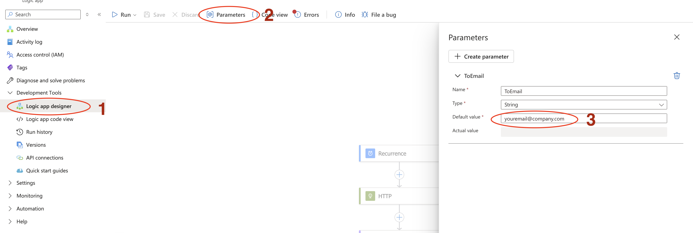
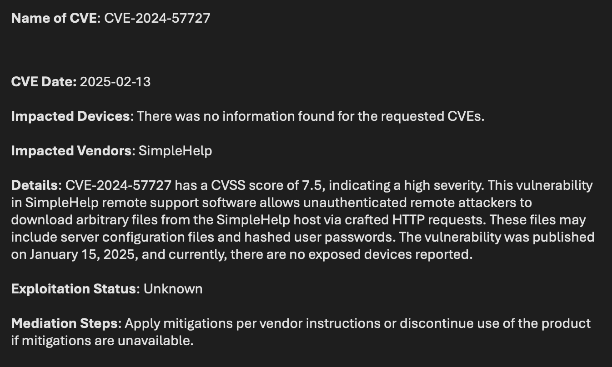

# Get the latest CISA vulnerabilities and check devices within my organization
Author: Jamil Mirza
This solution checks the latest CISA feed every 24 hours and queries the CVE finding against devices within Microsoft Defender for Endpoint. Security Copilot will check for remediation actions and enrich the description. It will also tell you how many (if any) devices in your organization are vulnerable to the reported CVE. Finally, an email with the findings is submitted to a mailbox which can be edited after the install of the Logic App.

## Deploy the Solution

### Step 1: Deploy the Logic App

Click the button below to deploy the Logic App. Select the resource group and change the Playbook name (if needed). You will enter this information in the deployment screen. 

### Step 2: Initialize O365 and Security Copilot API connections

Open your new Logic App.

Click "API Connections"

Authorize both of the API connections.

### Step 3: Change the email address

Open your new Logic App.

1. Click "Logic App Designer" (located under "Development Tools")

2. Click "Parameters"

3. Edit the default value to an email address of your choice.

### Step 4: Email Notification

Below is an example of the email received for each finding.

