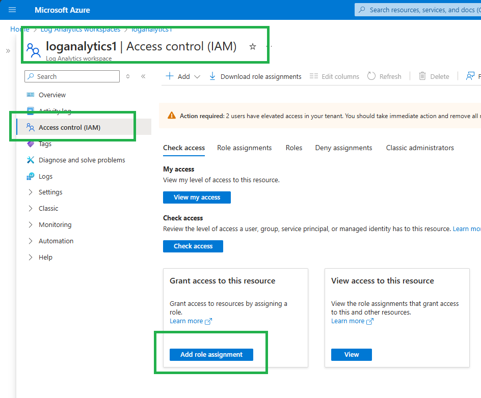
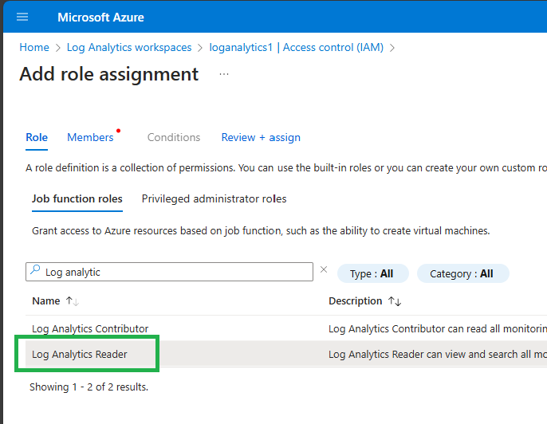
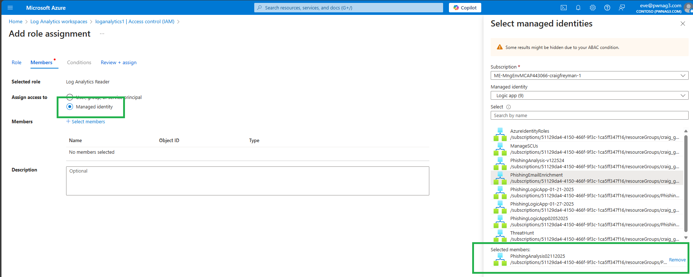

# Phishing Analysis with Security Copilot
**Author:** Craig Freyman

An automated solution for phishing email analysis using Azure Logic Apps, Function Apps, and Security Copilot. The system monitors a shared Office 365 mailbox, analyzes submitted emails for security threats, and generates detailed reports. Optional integration with Microsoft Sentinel for incident tracking and management.

## Prerequisites

1. **Azure Resources:**
   - Azure subscription
   - Contributor rights to the deployment target resource group
   - [Security Copilot Security Compute Units](https://learn.microsoft.com/en-us/copilot/security/get-started-security-copilot)
   - Microsoft Sentinel workspace (optional)

2. **Email Configuration:**
   - [Office 365 shared mailbox for monitoring](https://learn.microsoft.com/en-us/microsoft-365/admin/email/create-a-shared-mailbox?view=o365-worldwide)
   - Permissions to manage email configurations

## Deployment Steps

### 1. Deploy Function App

Required Parameters:
- FunctionAppName (name is prepended with "phish" and random characters are appended)
- FunctionAppResourceGroup

Wait for the Function App to fully deploy before moving on to step 2.

### 2. Deploy Logic App

Required Parameters:
- SubscriptionId
- LogicAppName
- FunctionAppName (step 1)
- FunctionAppResourceGroup (step 1)
- SharedMailboxAddress
- HTMLReportRecipient

Optional Sentinel Parameters (use "none" if not using Sentinel):
- LogAnalyticsWorkspaceName
- LogAnalyticsWorkspaceId
- LogAnalyticsResourceGroup

### 3. Configure API Connections

1. Open the Logic App in Azure Portal
2. Authorize these connections:
   - Office 365 (shared mailbox access)
   - Security Copilot
   - Azure Monitor Logs (if using Sentinel)
   - Sentinel (if using Sentinel)

### 4. Configure Logic App Permissions

If using Sentinel integration, assign these roles to the Logic App's managed identity:

1. "Log Analytics Reader" role (provides Microsoft.OperationalInsights/workspaces/read)
2. "Microsoft Sentinel Responder" role (provides Microsoft.SecurityInsights/incidents/comments/write)

Assign Permissions Step by Step

1. Open the Log Analytics workspace and go to "Access control (IAM)"

2. Select "Log Analytics Reader"

3. Select "Managed Identity" and select the name of your Logic App

4. Click next and assign permissions.
5. Repeat steps 1-4 for the "Microsoft Sentinel Responder" role.

### 5. Enable the Logic App

The Logic App deploys in a disabled state. Enable it in the Logic App Overview to begin operation.

## Features

- Automated email monitoring and analysis
- Detailed security assessment using Security Copilot
- Classification of emails (Phishing, Spam, Legitimate, Suspicious)
- HTML report generation
- Optional Sentinel incident integration

## Security Notes

- The solution uses system-managed identities for secure access
- Review and configure storage account security settings per your company policy
- Ensure minimum required permissions for all connections
- Regularly update Function App dependencies