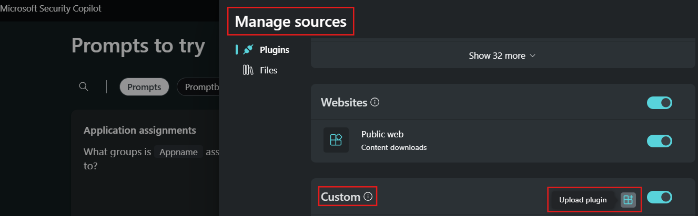
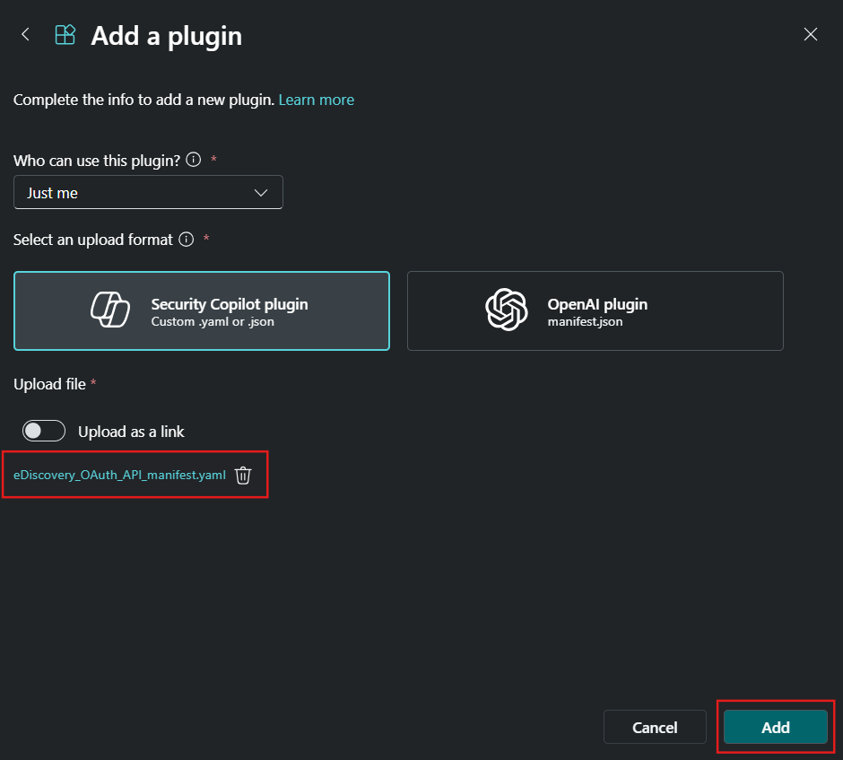

# eDiscovery Plugin for Security Copilot
Author: Amit Singh

This custom Security Copilot plugin enhances your organization's eDiscovery capabilities in Microsoft Purview. It is designed for workflows where you create a case and export artifacts directly. You can initiate an export from Search after indexing and estimating the artifacts. However, this plugin does not support workflows that involve attaching searches to a review set for further analysis in eDiscovery. Attaching searches to a review set is a manual process that must be completed within the case in the Purview portal.

### Prerequisites for Using Security Copilot

- **Ensure Security Copilot is Enabled**  
  Before you start, make sure Security Copilot is enabled in your environment. Follow the onboarding steps here:  
  [Get Started with Security Copilot](https://learn.microsoft.com/en-us/security-copilot/get-started-security-copilot#onboarding-to-microsoft-security-copilot)

- **Check Your Access to Upload Custom Plugins**  
  To use custom plugins, you need the proper permissions to upload them in Security Copilot. Learn how to manage and enable this feature here:  
  [Managing Custom Plugins](https://learn.microsoft.com/en-us/security-copilot/manage-plugins?tabs=securitycopilotplugin#managing-custom-plugins)

- **Set Up the Required Permissions for Your Application**  
  Your application must have the following permissions for Microsoft Graph (`https://graph.microsoft.com`):  
  - `offline_access`  
  - `user.read`  
  - `eDiscovery.Read.All`  
  - `eDiscovery.ReadWrite.All`  

  To register your application and configure these permissions, follow the steps here:  
  [Register an Application in Entra ID](https://learn.microsoft.com/en-us/graph/auth-register-app-v2#register-an-application)

## Setting Up the Custom Plugin in Security Copilot

### Uploading the Custom Plugin  

1. **Download the Required File**  
   - Obtain the file **[`eDiscovery_OAuth_API_manifest.yaml`](https://github.com/samitks77/Copilot-For-Security/blob/main/Plugins/Community%20Based%20Plugins/Purview/eDiscovery/eDiscovery_OAuth_API_manifest.yaml)** from the designated directory. This YAML file will be uploaded to **Security Copilot** during the setup process.
   
2. **Add Client ID & Tenant ID**  
   - From your **Entra ID App Registration**, make sure to add your **Client ID** and **Tenant ID** before proceeding with the 
   upload.    
     
   
3. **Generate and Copy Your Secret Value**
   - During the plugin upload process in **Security Copilot**, you will need a **Secret Value** from **Certificates & Secrets** in your Entra ID App.  
   - This **Secret Value** acts as your **API key** for the plugin to function correctly.  
   - **Important:** Copy your **Secret Value** immediately after creating it. If you navigate away from the page, the value will no longer be readable.
     
     

4. **Create Secrets in Entra ID**

   - Follow these steps to create and manage secrets for your application: 
   **[`How to Add Credentials in Entra ID`](https://learn.microsoft.com/en-us/graph/auth-register-app-v2#add-credentials)**

5. **Navigate to Custom Plugins**

   - Go to the **Manage Sources** on the home page of **Security Copilot**, and scroll down to the **Custom Plugins** section.

   

   
6. **Upload the Plugin File**

   - Click on **Security Copilot Plugin**, then upload the **`eDiscovery_OAuth_API_manifest.yaml`** file.

   

7.  **Enter the Client Secret and Connect**
   
    - Paste the **Client Secret Value** from your **Entra ID App Registration**.  
    - Click **Connect** to proceed.

     

8.  **Sign-In**

    Once you click **Connect**, a new window will open where you will need to sign in with your credentials.

### Plugin Setup Complete  

You have successfully set up the **eDiscovery Plugin** in **Security Copilot**. With the plugin uploaded, Client ID, Tenant ID, and Secret Value configured, and authentication completed, your integration is now ready to use. Security Copilot can now leverage this plugin for enhanced **eDiscovery capabilities**, allowing you to streamline investigations and data retrieval processes. If you encounter any issues, verify your Entra ID settings, ensure your Client Secret is valid, and check your Security Copilot permissions. 

### Skills & Prompts

🔹 **These are **suggested prompts** that you can use to interact with this plugin in **Security Copilot**. Each prompt helps you execute specific **eDiscovery actions efficiently**. You can modify these prompts based on your use case and organizational requirements. Below, you'll find structured input fields required for each action, ensuring precise execution of eDiscovery tasks. For a cleaner, structured view of the prompts, check out the HTML version below:**

👉 **[`Suggested Prompts in HTML`](https://htmlpreview.github.io/?https://raw.githubusercontent.com/samitks77/Copilot-For-Security/main/Plugins/Community%20Based%20Plugins/Purview/eDiscovery/sampleprompts.html)**

